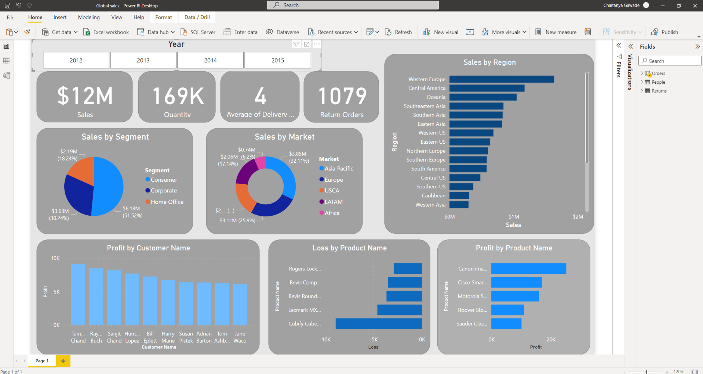

# PowerBI-Global-Sales
• Analyzed the tables and relations in the loaded data using Power BI to get better understanding of
problem statement.
• Performed Data Cleaning using Power Query editor to prepare data for further processes.
• Developed model and created interactive dashboards based on the global sales to showcase
various insights about the data.

